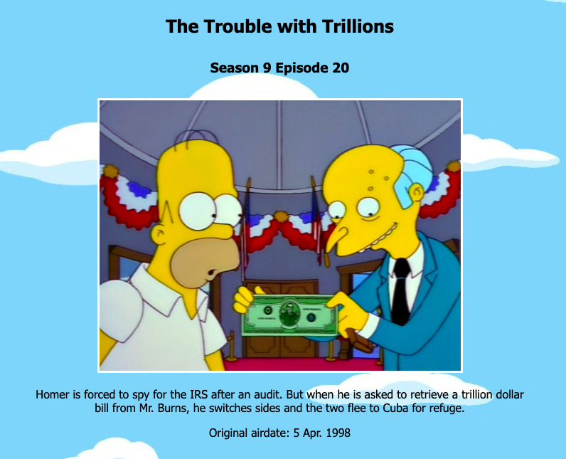

# random-simpsons-episode

###Overview

[Random Simpsons Episode Live](http://www.davidanderson.nyc/random-simpsons-episode)

Random Simpsons Episode takes a range of seasons for the TV show 'The Simpsons' and returns the title, airdate, and description of a randomly selected episode. 

### Technologies and Architecture

The Simpsons episode data was scraped from IMDB using the Python-built simpsons-scraper. The scraper wrote the episode data into a CSV file. Upon page load, an AJAX request is made to open the CSV file, and the episode data is formatted into JavaScript objects. When a random episode is generated, JQuery is used to update HTML elements. 

### Artistic credits

'The Simpsons' was created by Matt Groening for the Fox Broadcasting Company. All Simpsons episode data was pulled from the [Internet Movie Database](https://www.imdb.com/). 'The Simpsons' logo is from [Wikipedia](https://commons.wikimedia.org/wiki/File:Logo_The_Simpsons.svg). Endless Donuts gif is from [Giphy](https://giphy.com/gifs/loop-the-simpsons-eating-3u1bKI2ve3G3S). Small donut from [PicsArt](https://picsart.com/i/sticker-dona-delicious-pink-simpsons-donuts-strawberry-yomi-291448903009211). Sky background from [Simpsons fan wiki](https://simpsons.fandom.com/f).